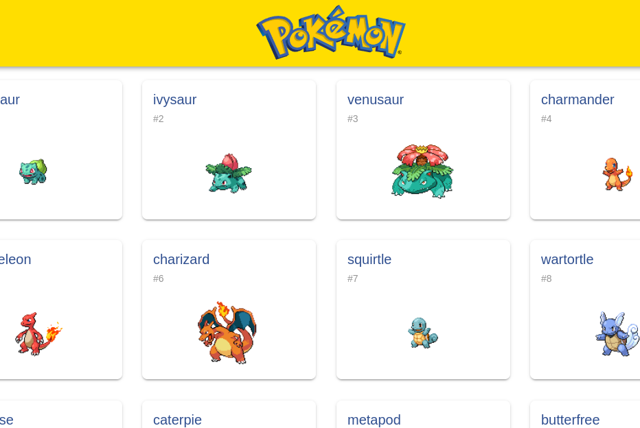
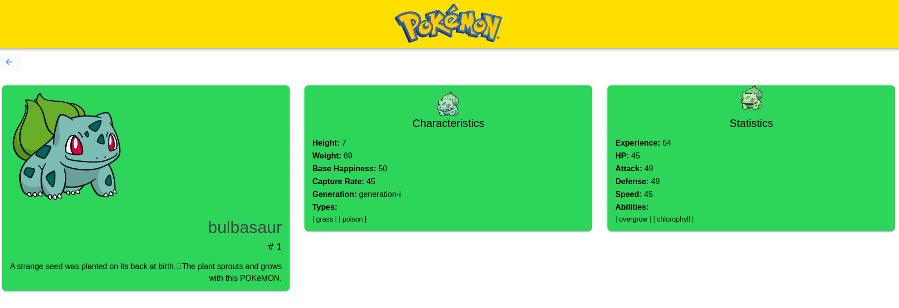

# Projeto

Este é um projeto construído com Ionic/Angula 8, PokeAPI 2, Typescript 5.2.

## Pré-requisitos

Certifique-se de ter o Docker e o Docker Compose instalados em sua máquina.

- Docker: [Instalação do Docker](https://docs.docker.com/get-docker/)
- Docker Compose: [Instalação do Docker Compose](https://docs.docker.com/compose/install/)
- Ferramenta de versionamento: [Instalação do Git](https://git-scm.com/)

## Documentação

A principal fonte dos dados deste aplicativo é a PokeAPI, uma api open-souce que possui contribuidores, uma infraestrutura robusta e claro, a sua documentação. 

Você poderá encontrar tudo isto facilmente aqui: [pokeapi.co](https://pokeapi.co/)

## Como executar

1. Clone o repositório:

```bash
git clone git@github.com:mactavishkkk/bsn-challenge.git
```

2. Navegue até o diretório dos arquivos de construção:

```bash
cd bsn-challenge
```

3. Construa as imagens para os ambientes com docker, no terminal use:

```bash
docker compose build
```

4. Agora basta subir elas com:

```bash
docker compose up -d
```

5. Pronto, agora você já poderá acessar a rota de boas vindas em seu navegador:

```bash
http://localhost/home
```

---

## Design

Foi-se usado algumas boas práticas do Clean Code e do Clean Architecture para o desenvolvimento desta aplicação. Como:

- Divisão em blocos de código
- Componentização
- Princípio responsabilidade única

Também foi encapsulado a api principal usada para o consumo dos dados em um Serviço. 

Assim é possível o reaproveitamento e o desacoplamento que nos permite ter acesso a algumas vantagens, como por exemplo, a criação de testes de unidade.

## Amostras

Aqui está algumas prints para pré-visualização da aplicação

### Tela Principal


### Tela de Detalhes
